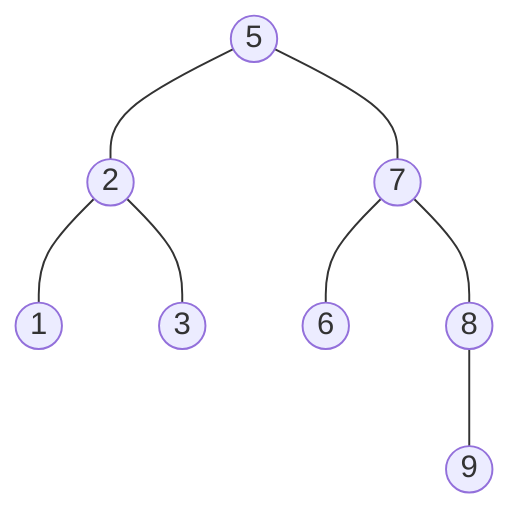

# Binary Search Tree

Try the [web app](https://binatry-tree-visualizer.vercel.app/)!

## What is a Binary Tree?

A binary tree is a data structure in CS where each node has at most two children, often referred to as the left child and the right child. This structure allows for efficient searching, insertion, and deletion operations. Here are some key properties and concepts related to binary trees:

## Concepts

- `Node`: The basic unit of a binary tree containing a value or data, and pointers to its children.
- `Root`: The topmost node of a binary tree. It is the ancestor of all other nodes.
- `Leaf`: A node that has no children.
- `Height`: The length of the longest path from the root to a leaf node. The height is the depth of the tree's deepest node. A leaf node will have a height of 0.
- `Depth`: The length of the path from the root to a particular node. A root node will have a depth of 0.

The Root Node is `5`. The Leaves are `1, 3, 6, 9.` The depth of `5` which is the Root Node is `0`. The depth of `9` is `3` (5 -> 7 -> 8 -> 9). The height of the tree is `3`. The height of node `1` is `0`. The height of node `7` is `2`.
