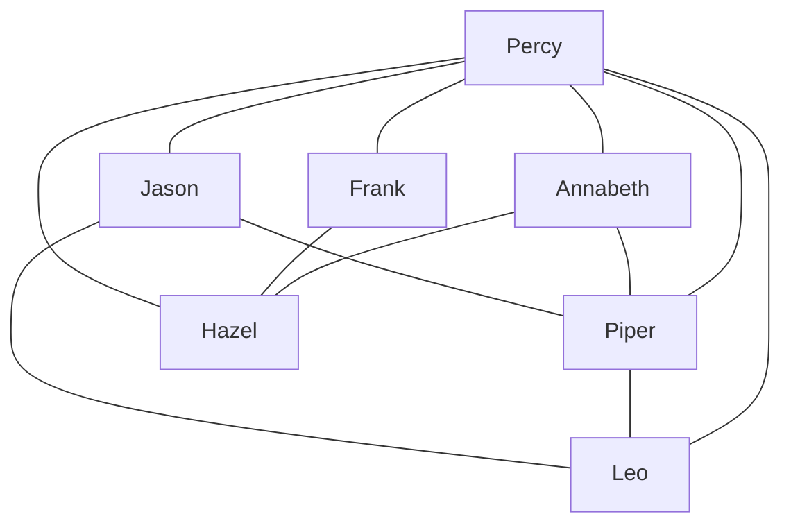

# Knights Travails

The Knights Travails is a problem in finding the shortest possible path for a knight piece to traverse in between 2 blocks on a chessboard.

|     |  A  |  B  |  C  |  D  |  E  |  F  |  G  |   H |
| :-- | :-: | :-: | :-: | :-: | :-: | :-: | :-: | --: |
| 8   |     |  S  |     |     |     |     |     |     |
| 7   |     |  └  |  ─  |  K  |     |     |     |     |
| 6   |     |     |     |  └  |  ─  |  K  |     |     |
| 5   |     |     |     |     |     |  │  |     |     |
| 4   |     |     |     |     |     |  └  |  K  |     |
| 3   |     |     |     |     |  T  |  ─  |  ┘  |     |
| 2   |     |     |     |     |     |     |     |     |
| 1   |     |     |     |     |     |     |     |     |

- `S` - Initial Knight Position
- `K` - Position traversed by Knight
- `T` - Target

## What is a graph?

The names are the `vertices`. The lines represent the `edges`. We denote an edge connecting vertices [u] and [v] by the pair (u,v) i.e. `(Percy,Annabeth)`. The number of edges incident on a vertex is the degree of the vertex.
