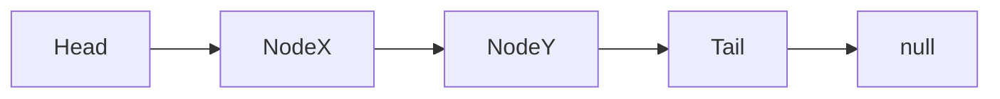

# Linked List

A linked list is a linear collection of data elements called nodes that “point” to the next node by means of a pointer.

The principal benefit of a linked list over a conventional array is that the list elements can easily be inserted or removed without reallocation of any other elements.

## Code

2 Main Classes:

1.  **Node** => a class that can generate nodes that corresponds to a _value_ and a pointer called _next_.
2.  **LinkedList** => a class that serves as the representation of the whole list of nodes or... linked lists.

## Running the project locally

1. Clone the repository.
2. (Optional) Install dependencies using **npm i**.
3. Run **npx ts-node [TSfile.ts]**
4. Install **tsc** for type-checking.
